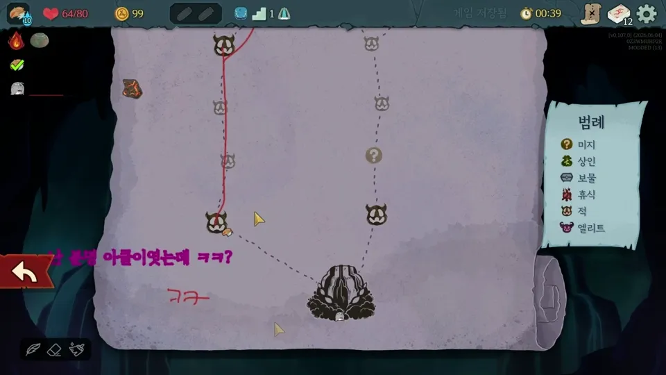

# Soul Change

A multiplayer mod for **Slay the Spire 2** that swaps every player's character, deck, relics, and full run state at the start of each floor.



## What It Does

In a multiplayer run, every time the party moves to a new floor, all players' "souls" rotate — each player takes over the other's character completely. This includes:

## Requirements

- Slay the Spire 2 (Steam)
- [.NET 9 SDK](https://dotnet.microsoft.com/download)
- Godot 4 with .NET (for the project structure)

## Building

```bash
dotnet build SoulChange.csproj
```

The build automatically copies `SoulChange.dll` and `SoulChange_manifest.json` to:

```
C:\Program Files (x86)\Steam\steamapps\common\Slay the Spire 2\mods\soul-change\
```
